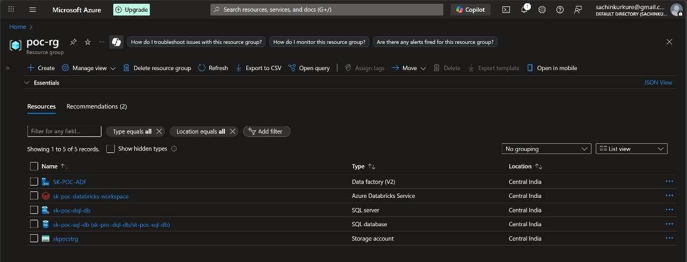
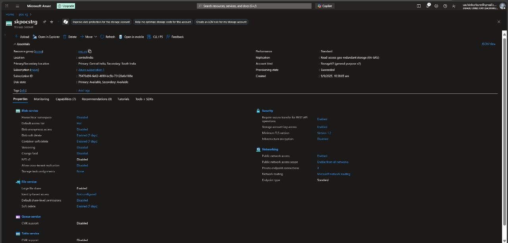
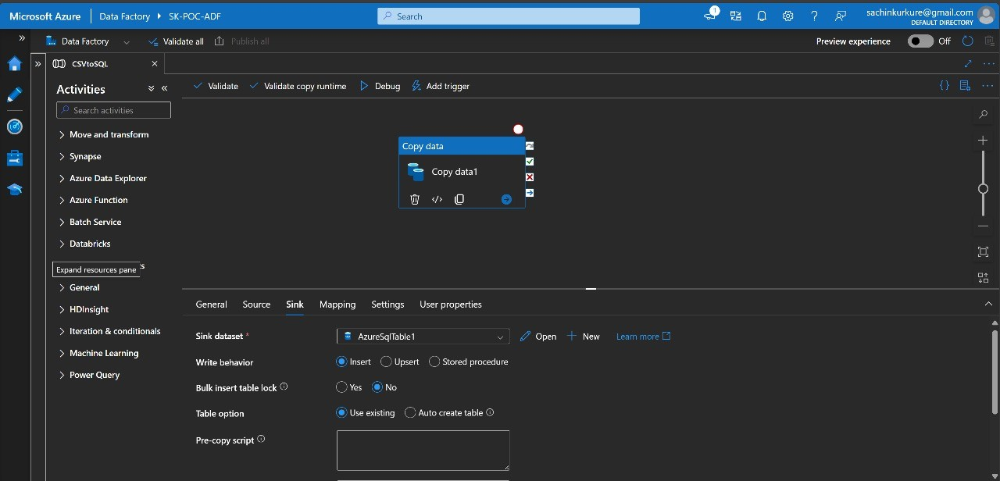
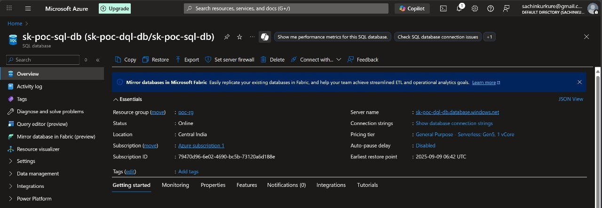
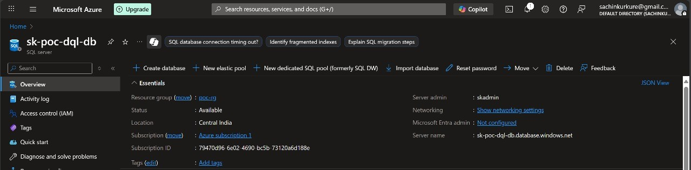
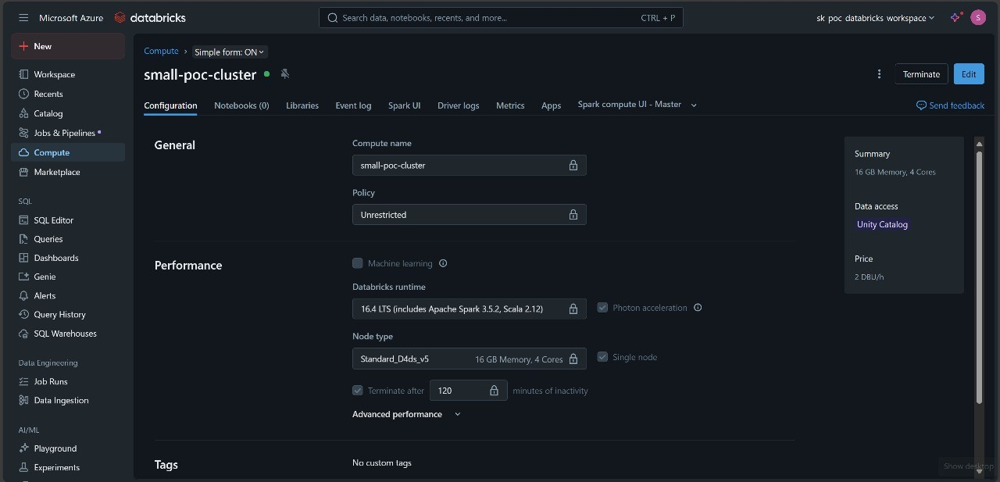

# Data Engineering PoC

This project demonstrates a simple **data pipeline** built on **Azure Data Factory**, loading data from CSV into Azure SQL Database and visualizing insights in **Power BI**.

---

## 🚀 Features

- Ingests CSV files from Azure Blob Storage

- Cleans and transforms data in ADF

- Stores processed data in Azure SQL Database

- Power BI dashboard for visualization

---

## 📸 Screenshots - Preview

Resource Group:

Storage:

Data Factory:

SQL DB:

SQL Server:

Data Bricks:

---

"# Data-Engineering-PoC"